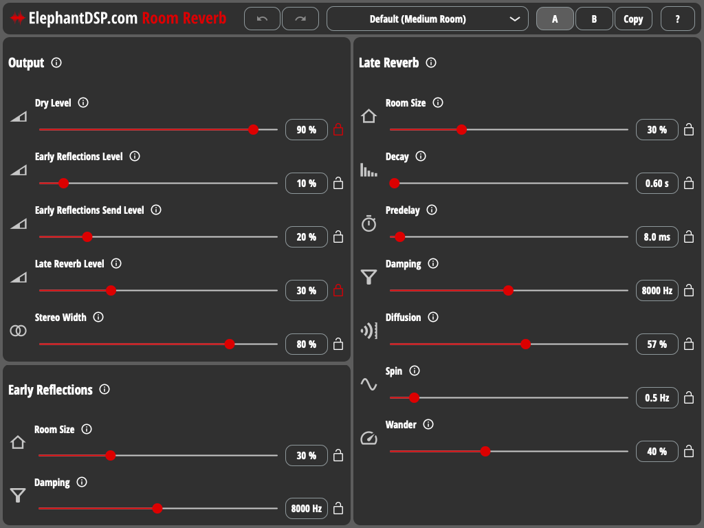

# ElephantDSP.com Room Reverb

Room Reverb is a mono/stereo to stereo algorithmic reverb audio plugin with many presets. It uses the implementation of Moorer's early reflection model and Jon Dattorro's Progenitor Reverb from the Freeverb3 signal processing library.

You can find more information about Room Reverb on my [website](https://www.elephantdsp.com/products/room-reverb/).



## Download
The latest release of Room Reverb can be downloaded on my [website](https://www.elephantdsp.com/products/room-reverb/).

## Building Room Reverb

Room Reverb uses the JUCE C++ framework. If you are on Linux, you need to install [these dependencies](https://github.com/juce-framework/JUCE/blob/master/docs/Linux%20Dependencies.md) first.
```
git clone --recurse-submodules https://github.com/cvde/RoomReverb.git
cd RoomReverb
cmake -DCMAKE_BUILD_TYPE=Release -B build
cmake --build build
```
## References
- [Freeverb3 signal processing library](https://www.nongnu.org/freeverb3/)
- [Freeverb3 algorithm references](https://freeverb3vst.osdn.jp/ref.shtml)
- [Freeverb3VST](https://freeverb3vst.osdn.jp/)
- [Dragonfly Reverb (also based on Freeverb3)](https://github.com/michaelwillis/dragonfly-reverb)

## Licenses
Room Reverb is free software and distributed under the [GNU General Public License Version 3](LICENSE).

Freeverb3 is free software and distributed under the [GNU General Public License Version 2](Freeverb3/COPYING).

JUCE is dual licenced under both the JUCE licence and the GNU General Public License Version 3.


All other trademarks, registered trademarks and logos or other manufacturers written or shown herein are the property of their respective owners. Use of them does not imply any affiliation with or endorsement by them.

